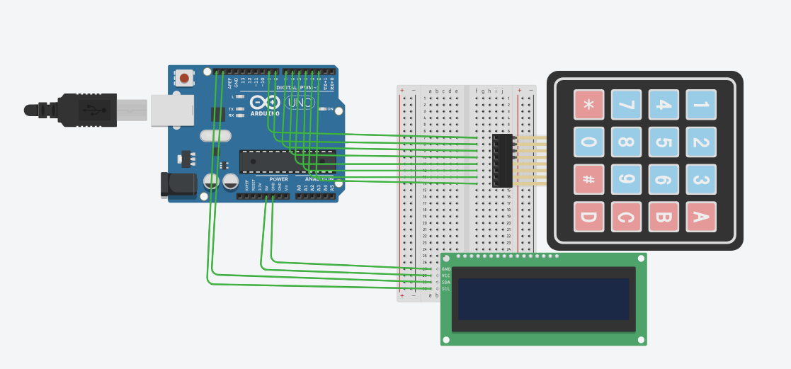

# ⌨️ Arduino 4x4 Keypad with I2C LCD

A simple **Arduino Uno 4x4 Keypad and 16x2 I2C LCD** project.  
This project reads the key pressed on a 4x4 matrix keypad and displays the entered keys on the LCD screen.

The LCD automatically moves the cursor from left to right and then to the second row. When the screen becomes full, it clears the display and starts again from the beginning.

---

## 📌 Project Overview

This project demonstrates how to:

- Interface a 4x4 matrix keypad with Arduino Uno
- Read keypad button presses
- Display keypad input on a 16x2 I2C LCD
- Use the `Keypad` library
- Use the `LiquidCrystal_I2C` library
- Automatically move the LCD cursor
- Clear the LCD when the screen is full

---

## 🖼️ Circuit Diagram



> **Note:** Save the circuit image in your GitHub repository as `circuit-diagram.png` so it appears correctly in this README.

---

## 🛠️ Components Required

- Arduino Uno
- 4x4 Matrix Keypad
- 16x2 I2C LCD
- Breadboard
- Jumper Wires
- USB Cable
- Computer
- Arduino IDE

---

## 🔌 Pin Configuration

### 4x4 Keypad

The keypad contains:

- 4 Row pins
- 4 Column pins

### Row Connections

| Keypad Row | Arduino Uno |
|---|---:|
| R1 | D9 |
| R2 | D8 |
| R3 | D7 |
| R4 | D6 |

### Column Connections

| Keypad Column | Arduino Uno |
|---|---:|
| C1 | D5 |
| C2 | D4 |
| C3 | D3 |
| C4 | D2 |

---

## 📟 I2C LCD Connections

| I2C LCD Pin | Arduino Uno |
|---|---:|
| GND | GND |
| VCC | 5V |
| SDA | A4 |
| SCL | A5 |

### Complete Connection

```text
4x4 Keypad
----------------
R1 → D9
R2 → D8
R3 → D7
R4 → D6

C1 → D5
C2 → D4
C3 → D3
C4 → D2


I2C LCD
----------------
GND → GND
VCC → 5V
SDA → A4
SCL → A5
