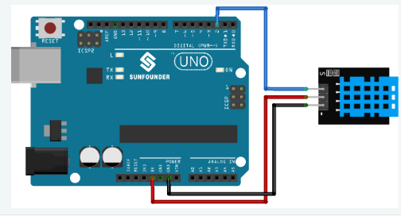

# 🌡️ Arduino DHT11 Temperature & Humidity Monitor

A simple **Arduino Uno + DHT11 Temperature and Humidity Sensor** project that measures **temperature, humidity, and heat index** and displays the results on the Arduino Serial Monitor.

The project uses the **DHT11 sensor** with the Arduino Uno and the `DHT.h` library.

---

## 📌 Project Overview

This project demonstrates how to:

- Read temperature from a DHT11 sensor
- Read humidity from a DHT11 sensor
- Convert temperature from Celsius to Fahrenheit
- Calculate heat index
- Display sensor data using the Serial Monitor
- Handle failed sensor readings

---

## 🖼️ Circuit Diagram



> **Note:** Save the circuit image in your GitHub repository as `circuit-diagram.png` so it appears correctly in this README.

---

## 🛠️ Components Required

- Arduino Uno
- DHT11 Temperature & Humidity Sensor
- Jumper Wires
- Breadboard (optional)
- USB Cable
- Computer
- Arduino IDE

---

## 🔌 Pin Configuration

### DHT11 Sensor

| DHT11 Pin | Arduino Uno |
|---|---:|
| VCC | 5V |
| DATA | D2 |
| GND | GND |

### Complete Connection

```text
DHT11 Sensor
----------------
VCC  → 5V
DATA → D2
GND  → GND
```

---

## 🌡️ DHT11 Sensor

The **DHT11** is a digital temperature and humidity sensor.

It can provide:

- 🌡️ Temperature
- 💧 Relative Humidity

The sensor communicates digitally with the Arduino.

In this project, the DATA pin is connected to:

```text
D2
```

---

## 📦 Required Library

This project requires the **DHT sensor library**.

The code uses:

```cpp
#include <DHT.h>
```

### Install Library

In Arduino IDE, go to:

```text
Sketch
   ↓
Include Library
   ↓
Manage Libraries
```

Search for:

```text
DHT sensor library
```

and install the appropriate **DHT sensor library**.

---

## 💻 Source Code

```cpp
#include <DHT.h>

#define DHTPIN 2       // Define the pin used to connect the sensor
#define DHTTYPE DHT11  // Define the sensor type

DHT dht(DHTPIN, DHTTYPE);  // Create a DHT object

void setup() {

  // Initialize the serial communication
  Serial.begin(9600);

  Serial.println(F("DHT11 test!"));

  dht.begin();  // Initialize the DHT sensor
}

void loop() {

  // Wait a few seconds between measurements.
  delay(2000);

  float h = dht.readHumidity();

  // Read temperature as Celsius
  float t = dht.readTemperature();

  // Read temperature as Fahrenheit
  float f = dht.readTemperature(true);

  // Check if any reads failed and exit early
  if (isnan(h) || isnan(t) || isnan(f)) {

    Serial.println(F("Failed to read from DHT sensor!"));

    return;
  }

  // Compute heat index in Fahrenheit
  float hif = dht.computeHeatIndex(f, h);

  // Compute heat index in Celsius
  float hic = dht.computeHeatIndex(t, h, false);

  // Print humidity, temperature and heat index
  Serial.print(F("Humidity: "));
  Serial.print(h);

  Serial.print(F("%  Temperature: "));
  Serial.print(t);

  Serial.print(F("°C "));

  Serial.print(f);

  Serial.print(F("°F  Heat index: "));
  Serial.print(hic);

  Serial.print(F("°C "));

  Serial.print(hif);

  Serial.println(F("°F"));
}
```

---

## ⚙️ How the Code Works

### 1. Include DHT Library

```cpp
#include <DHT.h>
```

This library provides functions for communicating with the DHT11 sensor.

---

### 2. Define Sensor Pin

```cpp
#define DHTPIN 2
```

The DHT11 DATA pin is connected to Arduino digital pin:

```text
D2
```

---

### 3. Define Sensor Type

```cpp
#define DHTTYPE DHT11
```

This tells the library that the connected sensor is a **DHT11**.

---

### 4. Create DHT Object

```cpp
DHT dht(DHTPIN, DHTTYPE);
```

This creates a DHT sensor object using:

```text
Pin  → D2
Type → DHT11
```

---

### 5. Start Serial Communication

```cpp
Serial.begin(9600);
```

The Arduino communicates with the Serial Monitor at:

```text
9600 baud
```

---

### 6. Initialize DHT Sensor

```cpp
dht.begin();
```

This initializes the DHT11 sensor.

---

### 7. Read Humidity

```cpp
float h = dht.readHumidity();
```

This reads the relative humidity from the sensor.

For example:

```text
Humidity: 65.00%
```

---

### 8. Read Temperature in Celsius

```cpp
float t = dht.readTemperature();
```

This reads the temperature in Celsius.

Example:

```text
Temperature: 28.00°C
```

---

### 9. Read Temperature in Fahrenheit

```cpp
float f = dht.readTemperature(true);
```

The `true` parameter tells the library to return the temperature in Fahrenheit.

Example:

```text
82.40°F
```

---

## 🔥 Heat Index

The **heat index** represents how hot the temperature feels when humidity is taken into account.

The code calculates heat index in Fahrenheit:

```cpp
float hif = dht.computeHeatIndex(f, h);
```

and Celsius:

```cpp
float hic = dht.computeHeatIndex(t, h, false);
```

---

## ⚠️ Sensor Error Handling

The program checks whether the sensor reading was successful:

```cpp
if (isnan(h) || isnan(t) || isnan(f)) {
  Serial.println(F("Failed to read from DHT sensor!"));
  return;
}
```

If the sensor fails to provide valid data, the Serial Monitor displays:

```text
Failed to read from DHT sensor!
```

---

## 📊 Expected Serial Monitor Output

Open the Serial Monitor and select:

```text
9600 baud
```

You should see output similar to:

```text
DHT11 test!

Humidity: 60.00%  Temperature: 28.00°C 82.40°F  Heat index: 29.50°C 85.10°F

Humidity: 61.00%  Temperature: 28.00°C 82.40°F  Heat index: 29.60°C 85.28°F

Humidity: 62.00%  Temperature: 29.00°C 84.20°F  Heat index: 30.50°C 86.90°F
```

The actual values will depend on the surrounding environment.

---

## ⏱️ Reading Interval

The program waits:

```cpp
delay(2000);
```

This means the sensor is read approximately every:

```text
2 seconds
```

This delay is useful because DHT11 sensors should not be queried too frequently.

---

## 🚀 How to Run the Project

### Step 1 — Install Arduino IDE

Install Arduino IDE on your computer.

### Step 2 — Install DHT Library

Open:

```text
Sketch → Include Library → Manage Libraries
```

Search for:

```text
DHT sensor library
```

and install it.

### Step 3 — Connect DHT11

Connect the sensor:

```text
VCC  → 5V
DATA → D2
GND  → GND
```

### Step 4 — Open the Code

Open:

```text
dht11_temperature_humidity.ino
```

### Step 5 — Select Arduino Board

Go to:

```text
Tools → Board → Arduino Uno
```

### Step 6 — Select COM Port

Go to:

```text
Tools → Port
```

Select the correct Arduino COM port.

### Step 7 — Upload

Click the **Upload** button.

### Step 8 — Open Serial Monitor

Open:

```text
Tools → Serial Monitor
```

Set the baud rate to:

```text
9600
```

The temperature, humidity, and heat index values will now appear.

---

## 🧪 Tinkercad Simulation

This project can also be simulated using **Tinkercad Circuits**, if the DHT11 component is available in the simulation environment.

### Simulation Components

- Arduino Uno
- DHT11 Sensor
- Jumper Wires

Connect:

```text
DHT11 VCC  → Arduino 5V
DHT11 DATA → Arduino D2
DHT11 GND  → Arduino GND
```

Start the simulation and open the Serial Monitor to view the sensor readings.

---

## 📁 Project Structure

```text
Arduino-DHT11/
│
├── README.md
├── dht11_temperature_humidity.ino
└── circuit-diagram.png
```

### Important

Save the circuit image in the repository as:

```text
circuit-diagram.png
```

The README displays it using:

```markdown

```

---

## 🎯 Learning Objectives

This project helps you understand:

- Arduino Uno
- DHT11 Sensor
- Temperature measurement
- Humidity measurement
- Celsius and Fahrenheit conversion
- Heat index
- Digital sensors
- Serial communication
- `DHT.h`
- `readHumidity()`
- `readTemperature()`
- `computeHeatIndex()`
- Error handling with `isnan()`
- Embedded systems fundamentals

---

## 🔮 Future Improvements

This project can be upgraded into:

- 🌡️ Temperature Monitoring System
- 💧 Humidity Monitoring System
- 📟 LCD Temperature Display
- 📊 Real-Time Temperature Dashboard
- 📱 Mobile Temperature Monitoring
- ☁️ IoT Weather Monitoring System
- 🔔 High Temperature Alert
- 💨 Automatic Fan Control
- 🌱 Smart Greenhouse System
- 🏠 Smart Home Environment Monitoring
- 📲 Mobile Notifications

---

## 🧰 Technologies Used

| Technology | Purpose |
|---|---|
| Arduino Uno | Microcontroller |
| C/C++ | Programming Language |
| DHT11 | Temperature & Humidity Sensor |
| DHT Library | Sensor Communication |
| Serial Monitor | Data Monitoring |
| Arduino IDE | Development Environment |
| Tinkercad | Circuit Simulation |

---

## ⚠️ Important Notes

- Connect the DHT11 DATA pin to **D2**.
- Connect VCC to **5V**.
- Connect GND to **GND**.
- Use the correct sensor type:
  ```cpp
  #define DHTTYPE DHT11
  ```
- Keep a reasonable delay between DHT11 readings.
- Sensor readings may vary depending on the surrounding environment.
- If you get `Failed to read from DHT sensor!`, check the wiring and library installation.

---

## 👨‍💻 Author

**Famid Khandoker**

BSc in Computer Science & Engineering

---

## ⭐ Support

If you find this project useful, please consider giving the repository a ⭐ on GitHub.

**Happy Coding! 🌡️💧🚀**
