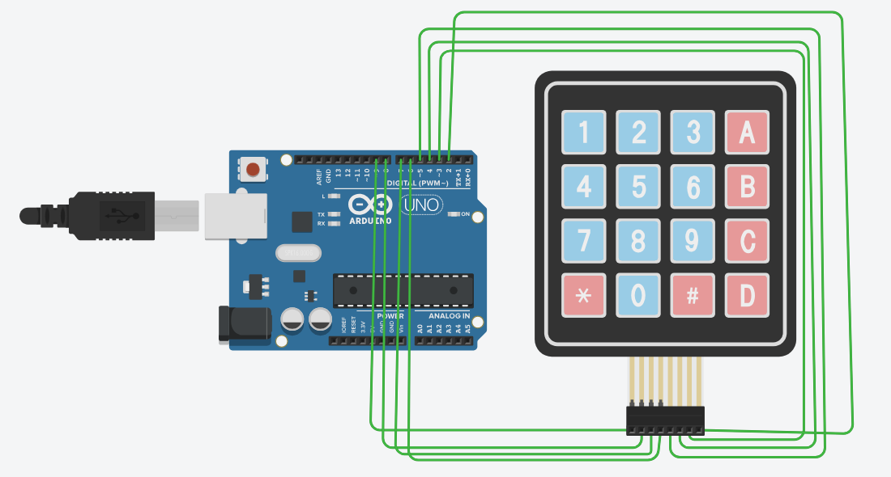

# 🔢 Arduino 4×4 Matrix Keypad

A simple **Arduino Uno 4×4 Matrix Keypad** project using the **Keypad Library**.

This project detects which key is pressed on the keypad and displays the pressed key in the **Arduino Serial Monitor**.

The keypad contains **16 keys**:

```text
1  2  3  A
4  5  6  B
7  8  9  C
*  0  #  D
```

---

## 📌 Project Overview

A **4×4 Matrix Keypad** consists of 4 rows and 4 columns, providing a total of:

```text
4 × 4 = 16 Keys
```

The Arduino Uno reads the keypad input using the **Keypad library**.

Whenever a key is pressed, Arduino detects it and prints the corresponding character to the **Serial Monitor**.

### Example

If you press:

```text
1
5
A
#
0
```

The Serial Monitor will display:

```text
1
5
A
#
0
```

---

## 🖼️ Circuit Diagram



---

## 🛠️ Components Required

* Arduino Uno
* 4×4 Matrix Keypad
* Jumper Wires
* USB Cable
* Computer
* Arduino IDE
* Keypad Library

---

## 🔌 Pin Configuration

The 4×4 Matrix Keypad has **8 pins**:

* 4 Row Pins
* 4 Column Pins

### Row Connections

| Keypad Row | Arduino Pin |
| ---------- | ----------: |
| Row 1      |          D9 |
| Row 2      |          D8 |
| Row 3      |          D7 |
| Row 4      |          D6 |

### Column Connections

| Keypad Column | Arduino Pin |
| ------------- | ----------: |
| Column 1      |          D5 |
| Column 2      |          D4 |
| Column 3      |          D3 |
| Column 4      |          D2 |

### Complete Connection Table

| Keypad Pin | Arduino Uno   |
| ---------- | ------------- |
| Row 1      | Digital Pin 9 |
| Row 2      | Digital Pin 8 |
| Row 3      | Digital Pin 7 |
| Row 4      | Digital Pin 6 |
| Column 1   | Digital Pin 5 |
| Column 2   | Digital Pin 4 |
| Column 3   | Digital Pin 3 |
| Column 4   | Digital Pin 2 |

---

## 🎹 Keypad Layout

```text
┌─────┬─────┬─────┬─────┐
│  1  │  2  │  3  │  A  │
├─────┼─────┼─────┼─────┤
│  4  │  5  │  6  │  B  │
├─────┼─────┼─────┼─────┤
│  7  │  8  │  9  │  C  │
├─────┼─────┼─────┼─────┤
│  *  │  0  │  #  │  D  │
└─────┴─────┴─────┴─────┘
```

---

## 📦 Required Library

This project uses the **Keypad** library.

### Install Keypad Library

Open Arduino IDE and go to:

```text
Sketch
   ↓
Include Library
   ↓
Manage Libraries
```

Search for:

```text
Keypad
```

Then install the **Keypad** library.

---

## 💻 Source Code

```cpp
#include <Keypad.h>

const byte ROWS = 4;
const byte COLS = 4;

char keys[ROWS][COLS] = {
  {'1','2','3','A'},
  {'4','5','6','B'},
  {'7','8','9','C'},
  {'*','0','#','D'}
};

byte rowPins[ROWS] = {9, 8, 7, 6};
byte colPins[COLS] = {5, 4, 3, 2};

Keypad keypad = Keypad(makeKeymap(keys), rowPins, colPins, ROWS, COLS);

void setup() {
  Serial.begin(9600);
}

void loop() {
  char key = keypad.getKey();

  if (key) {
    Serial.println(key);
  }
}
```

---

## ⚙️ How the Code Works

### 1. Include Keypad Library

```cpp
#include <Keypad.h>
```

The `Keypad` library provides functions for working with matrix keypads.

---

### 2. Define Rows and Columns

```cpp
const byte ROWS = 4;
const byte COLS = 4;
```

The keypad has:

```text
4 Rows × 4 Columns
```

Therefore, it has **16 keys**.

---

### 3. Define Key Mapping

```cpp
char keys[ROWS][COLS] = {
  {'1','2','3','A'},
  {'4','5','6','B'},
  {'7','8','9','C'},
  {'*','0','#','D'}
};
```

This array defines the character associated with every keypad button.

---

### 4. Define Arduino Pins

```cpp
byte rowPins[ROWS] = {9, 8, 7, 6};
byte colPins[COLS] = {5, 4, 3, 2};
```

The four row wires are connected to:

```text
D9, D8, D7, D6
```

The four column wires are connected to:

```text
D5, D4, D3, D2
```

---

### 5. Create Keypad Object

```cpp
Keypad keypad = Keypad(
  makeKeymap(keys),
  rowPins,
  colPins,
  ROWS,
  COLS
);
```

This creates the keypad object using the previously defined key layout and Arduino pins.

---

### 6. Start Serial Communication

```cpp
Serial.begin(9600);
```

This starts serial communication at **9600 baud**.

---

### 7. Detect Pressed Key

```cpp
char key = keypad.getKey();
```

The `getKey()` function checks whether a key has been pressed.

If a key is pressed:

```cpp
if (key) {
  Serial.println(key);
}
```

The pressed character is printed to the Serial Monitor.

---

## 🖥️ Serial Monitor Output

Open:

```text
Tools → Serial Monitor
```

Set the baud rate to:

```text
9600
```

If you press:

```text
1 → 2 → 3 → A → 5 → # → 0
```

The Serial Monitor will display:

```text
1
2
3
A
5
#
0
```

---

## 🚀 How to Run the Project

### Step 1 — Install Arduino IDE

Install Arduino IDE on your computer.

### Step 2 — Install Keypad Library

Install the **Keypad** library from the Arduino Library Manager.

### Step 3 — Connect the Keypad

Connect the keypad to the Arduino Uno according to the following configuration:

```text
Rows:
R1 → D9
R2 → D8
R3 → D7
R4 → D6

Columns:
C1 → D5
C2 → D4
C3 → D3
C4 → D2
```

### Step 4 — Open the Code

Open:

```text
keypad.ino
```

### Step 5 — Select Board

In Arduino IDE:

```text
Tools → Board → Arduino Uno
```

### Step 6 — Select COM Port

Go to:

```text
Tools → Port
```

and select the Arduino's COM port.

### Step 7 — Upload

Click the **Upload** button.

### Step 8 — Open Serial Monitor

Open the Serial Monitor and set the baud rate to:

```text
9600
```

Now press any key on the keypad.

---

## 🧪 Tinkercad Simulation

This project can also be simulated using **Tinkercad Circuits**.

Tinkercad allows you to test the Arduino and keypad connections virtually without physical hardware.

### Simulation Steps

1. Create a new Tinkercad Circuit.
2. Add an **Arduino Uno**.
3. Add a **4×4 Keypad**.
4. Connect the keypad according to the pin configuration.
5. Add the Arduino code.
6. Start the simulation.
7. Press keypad buttons.
8. Check the Serial Monitor.

---

## 📁 Project Structure

```text
Arduino-4x4-Keypad/
│
├── README.md
├── keypad.ino
└── circuit-diagram.png
```

### Important

The circuit image should be saved in the same repository folder with this exact filename:

```text
circuit-diagram.png
```

Then this line in `README.md` will display it:

```markdown

```

---

## 🎯 Learning Objectives

By completing this project, you can learn:

* Arduino Uno programming
* 4×4 Matrix Keypad
* Row and column configuration
* Digital pins
* Keypad Library
* `Keypad()` object
* `getKey()` function
* Serial communication
* `Serial.begin()`
* `Serial.println()`
* Embedded systems fundamentals

---

## 🔮 Future Improvements

This basic keypad project can be extended into many useful applications.

### 🔐 Password Door Lock

Use the keypad to enter a password and control a servo motor or electronic lock.

### 🧮 Calculator

Create a simple calculator using:

```text
0–9
+
-
*
/
=
```

### 🚪 Smart Door Lock

Combine the keypad with:

* Servo Motor
* LCD Display
* Buzzer
* Password system

### 🔢 Digital Counter

Use the keypad to increase, decrease, or reset a counter.

### 💡 LED Control

Use different keypad buttons to turn LEDs ON and OFF.

### 📟 LCD Integration

Display the pressed key on a 16×2 or 20×4 LCD.

---

## 🧰 Technologies Used

| Technology     | Purpose                 |
| -------------- | ----------------------- |
| Arduino Uno    | Microcontroller         |
| C/C++          | Programming Language    |
| Keypad Library | Keypad Interface        |
| Arduino IDE    | Development Environment |
| Tinkercad      | Circuit Simulation      |

---

## 📸 Project Preview

The repository includes the Arduino circuit diagram showing the **4×4 Matrix Keypad connected to Arduino Uno**.

```text
Arduino Uno
     │
     │
     ├── Row 1 → D9
     ├── Row 2 → D8
     ├── Row 3 → D7
     ├── Row 4 → D6
     │
     ├── Col 1 → D5
     ├── Col 2 → D4
     ├── Col 3 → D3
     └── Col 4 → D2
           │
           ▼
      4×4 Keypad
```

---

## 👨‍💻 Author

**Famid Khandoker**

BSc in Computer Science & Engineering

---

## ⭐ Support

If you find this project useful, please consider giving the repository a ⭐ on GitHub.

**Happy Coding! 🚀**
