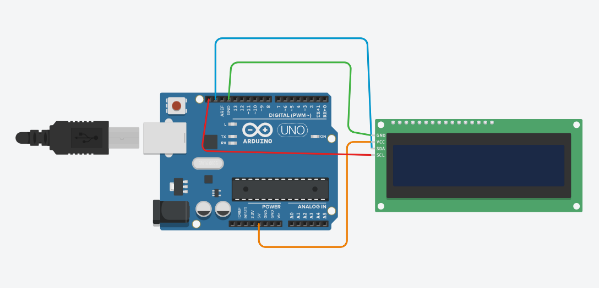

# 📟 Arduino I2C LCD Display

A simple **Arduino Uno + 16×2 I2C LCD** project that displays a custom greeting message on a two-line LCD screen using the **LiquidCrystal_I2C** library.

The project demonstrates how to initialize an I2C LCD, turn on its backlight, position the cursor, and display text.

---

## 📌 Project Overview

In this project, an **Arduino Uno** is connected to a **16×2 I2C LCD Display**.

The LCD displays:

```text
Hello,Famid!
Arduino I2C LCD
```

The first line displays a personalized greeting, while the second line identifies the project.

---

## 🖼️ Circuit Diagram

> **Note:** Save the circuit image in your GitHub repository as `circuit-diagram.png` so it appears correctly in the README.

---

## 🛠️ Components Required

* Arduino Uno
* 16×2 I2C LCD Display
* Jumper Wires
* USB Cable
* Computer
* Arduino IDE

---

## 🔌 I2C LCD Pin Configuration

The I2C LCD module has four main pins:

| LCD Pin | Arduino Uno |
| ------- | ----------- |
| GND     | GND         |
| VCC     | 5V          |
| SDA     | A4          |
| SCL     | A5          |

### Connection Diagram

```text
I2C LCD          Arduino Uno
----------------------------
GND       →      GND
VCC       →      5V
SDA       →      A4
SCL       →      A5
```

### Arduino Uno I2C Pins

```text
SDA → A4
SCL → A5
```

---

## 📺 LCD Display

The project uses a:

```text
16 Columns × 2 Rows
```

LCD layout:

```text
┌────────────────┐
│ Hello,Famid!   │
│ Arduino I2C LCD│
└────────────────┘
```

---

## 📦 Required Libraries

This project requires the following libraries:

### Wire Library

```cpp
#include <Wire.h>
```

The `Wire` library provides I2C communication between the Arduino and LCD.

### LiquidCrystal_I2C Library

```cpp
#include <LiquidCrystal_I2C.h>
```

This library makes it easier to control an I2C LCD.

### Install Library

In Arduino IDE, go to:

```text
Sketch
   ↓
Include Library
   ↓
Manage Libraries
```

Search for:

```text
LiquidCrystal I2C
```

and install a compatible **LiquidCrystal_I2C** library.

---

## 💻 Source Code

```cpp
#include <Wire.h> 
#include <LiquidCrystal_I2C.h>

// Set the LCD address to 0x27 for a 16 chars and 2 line display
// (If 0x27 doesn't work, try 0x3F or 0x20)
LiquidCrystal_I2C lcd(0x27, 16, 2); 

void setup() {
  lcd.init();         // Initialize the LCD
  lcd.backlight();    // Turn on the backlight
  
  lcd.setCursor(0, 0);       // Move cursor to column 0, row 0
  lcd.print("Hello,Famid!"); // Print message
  
  lcd.setCursor(0, 1);       // Move cursor to column 0, row 1
  lcd.print("Arduino I2C LCD");
}

void loop() {
  // Code in the loop runs continuously
  // Empty for static text
}
```

---

## ⚙️ How It Works

### 1. Include Required Libraries

```cpp
#include <Wire.h>
#include <LiquidCrystal_I2C.h>
```

`Wire.h` handles I2C communication, while `LiquidCrystal_I2C.h` provides functions for controlling the LCD.

---

### 2. Set LCD Address

```cpp
LiquidCrystal_I2C lcd(0x27, 16, 2);
```

Here:

* `0x27` → I2C address of the LCD
* `16` → Number of columns
* `2` → Number of rows

Some LCD modules may use another address such as:

```text
0x3F
```

or:

```text
0x20
```

If `0x27` does not work, check the actual I2C address of your LCD.

---

### 3. Initialize LCD

```cpp
lcd.init();
```

This initializes the LCD and prepares it for displaying text.

---

### 4. Turn On Backlight

```cpp
lcd.backlight();
```

This turns on the LCD backlight.

---

### 5. Set Cursor Position

```cpp
lcd.setCursor(0, 0);
```

The first value represents the **column**, and the second represents the **row**.

For example:

```text
lcd.setCursor(0, 0);
```

means:

```text
Column 0
Row 0
```

which is the first position of the first line.

---

### 6. Print Text

```cpp
lcd.print("Hello,Famid!");
```

This displays:

```text
Hello,Famid!
```

on the first line.

---

### 7. Display Second Line

```cpp
lcd.setCursor(0, 1);
lcd.print("Arduino I2C LCD");
```

This moves the cursor to the second row and displays:

```text
Arduino I2C LCD
```

---

## 📟 Expected Output

After uploading the code, the LCD should display:

```text
┌────────────────┐
│ Hello,Famid!   │
│ Arduino I2C LCD│
└────────────────┘
```

---

## 🚀 How to Run the Project

### Step 1 — Install Arduino IDE

Install the Arduino IDE on your computer.

### Step 2 — Install Library

Install:

```text
LiquidCrystal_I2C
```

### Step 3 — Connect the LCD

Connect the LCD to the Arduino Uno:

```text
GND → GND
VCC → 5V
SDA → A4
SCL → A5
```

### Step 4 — Open the Code

Open:

```text
lcd_i2c.ino
```

### Step 5 — Select Arduino Board

Go to:

```text
Tools → Board → Arduino Uno
```

### Step 6 — Select COM Port

Go to:

```text
Tools → Port
```

and select the correct Arduino COM port.

### Step 7 — Upload

Click the **Upload** button.

The LCD should display the two messages.

---

## 🧪 Troubleshooting

### LCD Backlight Is On but No Text

First check the I2C address.

The code currently uses:

```cpp
LiquidCrystal_I2C lcd(0x27, 16, 2);
```

Try:

```cpp
LiquidCrystal_I2C lcd(0x3F, 16, 2);
```

if `0x27` does not work.

---

### LCD Shows Boxes

Check:

* SDA connection
* SCL connection
* VCC connection
* GND connection
* I2C address

You may also need to adjust the **contrast potentiometer** on the back of the I2C LCD module.

---

### Arduino Uno I2C Pins

For Arduino Uno:

```text
SDA → A4
SCL → A5
```

Make sure these connections are correct.

---

## 🧪 Tinkercad Simulation

The project can be recreated and tested using **Tinkercad Circuits**, if an I2C LCD component/library configuration is available in the simulator.

You can use the simulation to understand:

* I2C communication
* LCD initialization
* Cursor positioning
* Text display

---

## 📁 Project Structure

```text
Arduino-I2C-LCD/
│
├── README.md
├── lcd_i2c.ino
└── circuit-diagram.png
```

### Important

Keep the circuit image in the same repository folder as `README.md`:

```text
circuit-diagram.png
```

The following Markdown will then display the image:

```markdown

```

---

## 🎯 Learning Objectives

This project helps you understand:

* Arduino Uno
* 16×2 LCD
* I2C communication
* SDA and SCL
* `Wire.h`
* `LiquidCrystal_I2C`
* LCD initialization
* LCD backlight
* Cursor positioning
* Displaying text
* Arduino digital communication

---

## 🔮 Future Improvements

This basic LCD project can be extended with:

* 🕐 Digital Clock
* 🌡️ Temperature Display
* 💧 Humidity Display
* 🔢 Counter
* 🔐 Password System
* 🎹 Keypad Input
* 📊 Sensor Data Display
* 🚦 Traffic Light Status
* 🌱 Smart Plant Monitoring
* 🏠 Home Automation System

---

## 🧰 Technologies Used

| Technology        | Purpose                 |
| ----------------- | ----------------------- |
| Arduino Uno       | Microcontroller         |
| C/C++             | Programming Language    |
| I2C               | Communication Protocol  |
| LiquidCrystal_I2C | LCD Control             |
| Wire Library      | I2C Communication       |
| Arduino IDE       | Development Environment |

---

## 📸 Project Preview

The circuit uses an Arduino Uno connected to a **16×2 I2C LCD**.

```text
          Arduino Uno
               │
       ┌───────┴───────┐
       │               │
      A4              A5
       │               │
      SDA             SCL
       │               │
       └───────┬───────┘
               │
          ┌────▼─────┐
          │ 16×2 LCD │
          │   I2C    │
          └──────────┘
```

---

## 👨‍💻 Author

**Famid Khandoker**

BSc in Computer Science & Engineering

---

## ⭐ Support

If you find this project useful, please consider giving the repository a ⭐ on GitHub.

**Happy Coding! 🚀**
