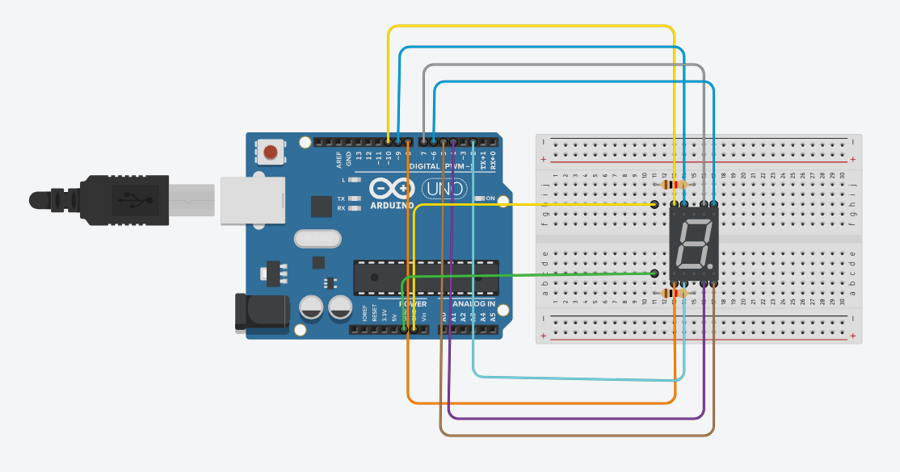

# 🔢 Arduino Seven Segment Display

A simple **Arduino Seven Segment Display** project that displays the numbers **0 to 9** sequentially. Each number is displayed for **1 second** before moving to the next number.

This project is suitable for beginners learning **Arduino digital output, GPIO pins, and seven-segment displays**.

---

## 📌 Project Overview

In this project, an **Arduino Uno** is connected to a **7-Segment Display**. The Arduino controls each segment individually using digital pins.

The display automatically counts:

**0 → 1 → 2 → 3 → 4 → 5 → 6 → 7 → 8 → 9**

After displaying `9`, the sequence starts again from `0`.

---

## 🛠️ Components Required

* Arduino Uno
* 1 × Seven Segment Display
* 8 × Resistors
* Breadboard
* Jumper Wires
* USB Cable
* Tinkercad (optional, for simulation)

---

## 🔌 Pin Configuration

| Seven Segment | Arduino Pin |
| ------------- | ----------: |
| A             |          10 |
| B             |          11 |
| C             |           5 |
| D             |           6 |
| E             |           7 |
| F             |           9 |
| G             |           8 |
| DP            |           4 |

### Segment Mapping

```text
       A
      ---
   F |   | B
      -G-
   E |   | C
      ---
       D

      DP
```

---

## 🔧 Circuit Diagram

Add the circuit image to your repository as:

```text
circuit-diagram.png
```

Then use:

```markdown

```

### Circuit


---

## 💻 Source Code

```cpp
unsigned const int G = 8;
unsigned const int F = 9;
unsigned const int A = 10;
unsigned const int B = 11;
unsigned const int E = 7;
unsigned const int D = 6;
unsigned const int C = 5;
unsigned const int DP = 4;

void setup(void)
{
  pinMode(A, OUTPUT);
  pinMode(B, OUTPUT);
  pinMode(C, OUTPUT);
  pinMode(D, OUTPUT);
  pinMode(E, OUTPUT);
  pinMode(F, OUTPUT);
  pinMode(G, OUTPUT);
  pinMode(DP, OUTPUT);
}

void zero(void)
{
  digitalWrite(A, HIGH);
  digitalWrite(B, HIGH);
  digitalWrite(C, HIGH);
  digitalWrite(D, HIGH);
  digitalWrite(E, HIGH);
  digitalWrite(F, HIGH);
  digitalWrite(G, LOW);
  digitalWrite(DP, LOW);
}

void one(void)
{
  digitalWrite(A, LOW);
  digitalWrite(B, HIGH);
  digitalWrite(C, HIGH);
  digitalWrite(D, LOW);
  digitalWrite(E, LOW);
  digitalWrite(F, LOW);
  digitalWrite(G, LOW);
  digitalWrite(DP, LOW);
}

void two(void)
{
  digitalWrite(A, HIGH);
  digitalWrite(B, HIGH);
  digitalWrite(C, LOW);
  digitalWrite(D, HIGH);
  digitalWrite(E, HIGH);
  digitalWrite(F, LOW);
  digitalWrite(G, HIGH);
  digitalWrite(DP, LOW);
}

void three(void)
{
  digitalWrite(A, HIGH);
  digitalWrite(B, HIGH);
  digitalWrite(C, HIGH);
  digitalWrite(D, HIGH);
  digitalWrite(E, LOW);
  digitalWrite(F, LOW);
  digitalWrite(G, HIGH);
  digitalWrite(DP, LOW);
}

void four(void)
{
  digitalWrite(A, LOW);
  digitalWrite(B, HIGH);
  digitalWrite(C, HIGH);
  digitalWrite(D, LOW);
  digitalWrite(E, LOW);
  digitalWrite(F, HIGH);
  digitalWrite(G, HIGH);
  digitalWrite(DP, LOW);
}

void five(void)
{
  digitalWrite(A, HIGH);
  digitalWrite(B, LOW);
  digitalWrite(C, HIGH);
  digitalWrite(D, HIGH);
  digitalWrite(E, LOW);
  digitalWrite(F, HIGH);
  digitalWrite(G, HIGH);
  digitalWrite(DP, LOW);
}

void six(void)
{
  digitalWrite(A, HIGH);
  digitalWrite(B, LOW);
  digitalWrite(C, HIGH);
  digitalWrite(D, HIGH);
  digitalWrite(E, HIGH);
  digitalWrite(F, HIGH);
  digitalWrite(G, HIGH);
  digitalWrite(DP, LOW);
}

void seven(void)
{
  digitalWrite(A, HIGH);
  digitalWrite(B, HIGH);
  digitalWrite(C, HIGH);
  digitalWrite(D, LOW);
  digitalWrite(E, LOW);
  digitalWrite(F, LOW);
  digitalWrite(G, LOW);
  digitalWrite(DP, LOW);
}

void eight(void)
{
  digitalWrite(A, HIGH);
  digitalWrite(B, HIGH);
  digitalWrite(C, HIGH);
  digitalWrite(D, HIGH);
  digitalWrite(E, HIGH);
  digitalWrite(F, HIGH);
  digitalWrite(G, HIGH);
  digitalWrite(DP, LOW);
}

void nine(void)
{
  digitalWrite(A, HIGH);
  digitalWrite(B, HIGH);
  digitalWrite(C, HIGH);
  digitalWrite(D, HIGH);
  digitalWrite(E, LOW);
  digitalWrite(F, HIGH);
  digitalWrite(G, HIGH);
  digitalWrite(DP, LOW);
}

void loop(void)
{
  zero();
  delay(1000);

  one();
  delay(1000);

  two();
  delay(1000);

  three();
  delay(1000);

  four();
  delay(1000);

  five();
  delay(1000);

  six();
  delay(1000);

  seven();
  delay(1000);

  eight();
  delay(1000);

  nine();
  delay(1000);
}
```

---

## ⚙️ How It Works

1. The Arduino initializes pins **4–11** as output pins.
2. Each function (`zero()`, `one()`, ..., `nine()`) controls the seven-segment display.
3. `HIGH` turns a segment **ON**.
4. `LOW` turns a segment **OFF**.
5. The `loop()` function calls each number function sequentially.
6. `delay(1000)` keeps each number visible for **1 second**.
7. After `9`, the program starts again from `0`.

---

## 🎯 Output

The seven-segment display will show:

```text
0
↓
1
↓
2
↓
3
↓
4
↓
5
↓
6
↓
7
↓
8
↓
9
↓
0
...
```

Each digit remains visible for approximately **1 second**.

---

## 📁 Project Structure

```text
Arduino-Seven-Segment/
│
├── README.md
├── seven_segment.ino
└── circuit-diagram.png
```

---

## 🚀 How to Run

### Using Arduino IDE

1. Install **Arduino IDE**.
2. Connect the Arduino Uno to your computer.
3. Open `seven_segment.ino`.
4. Select:

```text
Tools → Board → Arduino Uno
```

5. Select the correct COM port.
6. Click **Upload**.
7. The seven-segment display will start counting from **0 to 9**.

---

## 🧪 Simulation

This circuit can also be simulated using **Tinkercad Circuits**.

You can test the circuit virtually before connecting the physical components.

---

## 📚 Learning Objectives

Through this project, you can learn:

* Arduino digital output
* GPIO pin control
* Seven-segment display
* `digitalWrite()`
* `pinMode()`
* Functions in Arduino
* `delay()` function
* Basic embedded systems
* Breadboard circuit connections

---

## 👨‍💻 Author

**Famid Khandoker**

BSc in Computer Science & Engineering

---

## ⭐ Support

If you find this project useful, consider giving the repository a ⭐ on GitHub.

**Happy Coding! 🚀**
