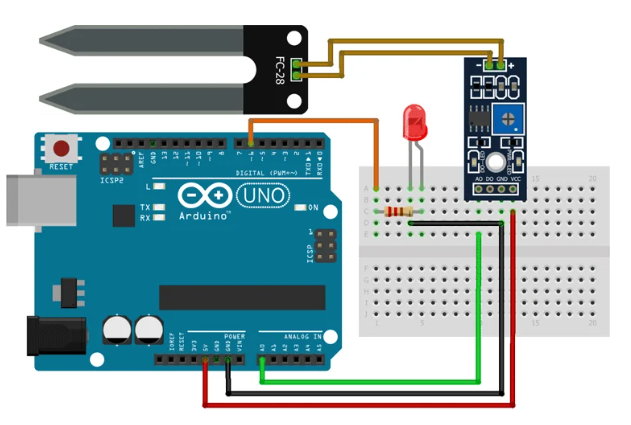

# 🌱 Arduino Soil Moisture Sensor with LED

A simple **Arduino Uno Soil Moisture Sensor project** that reads the moisture level of soil using an **FC-28 Soil Moisture Sensor** and controls the brightness of an **LED** according to the detected moisture value.

The sensor provides an analog value through `A0`, which is converted into a PWM value from `0–255` and used to control the LED brightness.

---

## 📌 Project Overview

This project demonstrates how to:

- Read analog data from a soil moisture sensor
- Convert the sensor value using `map()`
- Generate PWM output using `analogWrite()`
- Control LED brightness based on soil moisture
- Display sensor values through the Serial Monitor

### Working Principle

```text
        🌱 Soil
          │
          ▼
   ┌───────────────┐
   │ FC-28 Sensor  │
   │ Soil Moisture │
   │    Sensor     │
   └───────┬───────┘
           │
           │ Analog Signal
           ▼
   ┌───────────────┐
   │  Arduino Uno  │
   │      A0       │
   └───────┬───────┘
           │
           │ PWM
           ▼
       ┌───────┐
       │  LED  │
       └───────┘
```

---

## 🖼️ Circuit Diagram



> **Note:** Save the circuit image in your GitHub repository as `circuit-diagram.png` so it appears correctly in this README.

---

## 🛠️ Components Required

- Arduino Uno
- FC-28 Soil Moisture Sensor
- Soil Moisture Sensor Probe
- LED
- 220Ω Resistor
- Breadboard
- Jumper Wires
- USB Cable
- Computer
- Arduino IDE

---

## 🔌 Pin Configuration

### FC-28 Soil Moisture Sensor Module

| Sensor Pin | Arduino Uno |
|---|---:|
| VCC | 5V |
| GND | GND |
| AO | A0 |
| DO | Not Used |

### LED

| LED Connection | Arduino Uno |
|---|---:|
| Anode (+) | D6 through 220Ω resistor |
| Cathode (-) | GND |

### Complete Connection

```text
FC-28 Sensor
----------------
VCC → 5V
GND → GND
AO  → A0


LED
----------------
Anode (+)    → 220Ω Resistor → D6
Cathode (-) → GND
```

---

## 🌱 FC-28 Soil Moisture Sensor

The FC-28 sensor is used to measure the moisture level of soil.

The sensor provides an **analog output** that can be read by Arduino using:

```cpp
analogRead(A0);
```

The Arduino ADC provides a 10-bit value:

```text
0 → 1023
```

The project then maps this value into an 8-bit PWM range:

```text
0 → 255
```

---

## 💻 Source Code

```cpp
#define ledPin 6

#define sensorPin A0

void setup() {

  Serial.begin(9600);

  pinMode(ledPin, OUTPUT);

  digitalWrite(ledPin, LOW);
}

void loop() {

  Serial.print("Analog output: ");

  Serial.println(readSensor());

  delay(500);
}

// This function returns the analog data to calling function
int readSensor() {

  int sensorValue = analogRead(sensorPin);

  // Map the 10-bit data to 8-bit data
  int outputValue = map(sensorValue, 0, 1023, 255, 0);

  // Generate PWM signal
  analogWrite(ledPin, outputValue);

  // Return analog moisture value
  return outputValue;
}
```

---

## ⚙️ How the Code Works

### 1. Define Pins

```cpp
#define ledPin 6
#define sensorPin A0
```

The soil moisture sensor is connected to:

```text
A0
```

and the LED is connected to:

```text
D6
```

---

### 2. Start Serial Communication

```cpp
Serial.begin(9600);
```

This allows the Arduino to send sensor values to the Serial Monitor.

---

### 3. Configure LED Pin

```cpp
pinMode(ledPin, OUTPUT);
```

The LED pin is configured as an output.

Initially:

```cpp
digitalWrite(ledPin, LOW);
```

turns the LED off.

---

### 4. Read Sensor Value

The sensor value is read using:

```cpp
int sensorValue = analogRead(sensorPin);
```

Arduino returns a value between:

```text
0 → 1023
```

---

### 5. Convert Sensor Value

The program uses:

```cpp
int outputValue = map(sensorValue, 0, 1023, 255, 0);
```

This converts:

```text
Sensor Input: 0 → 1023
```

into:

```text
PWM Output: 255 → 0
```

The range is reversed so that the output value represents the moisture level according to the sensor's analog behavior.

---

### 6. Control LED Brightness

```cpp
analogWrite(ledPin, outputValue);
```

This generates a PWM signal on pin `D6`.

The LED brightness changes according to the calculated sensor value.

---

### 7. Display Value

The sensor value is printed to the Serial Monitor:

```cpp
Serial.print("Analog output: ");
Serial.println(readSensor());
```

Example:

```text
Analog output: 180
Analog output: 165
Analog output: 142
Analog output: 120
```

---

## 📊 Sensor Value

The Arduino reads a 10-bit analog value:

| Analog Value | Description |
|---:|---|
| 0 | Minimum sensor reading |
| 512 | Middle range |
| 1023 | Maximum sensor reading |

The exact relationship between the raw value and actual soil moisture depends on the sensor, probe, soil, and calibration.

---

## 💡 LED Behavior

The LED brightness is controlled using PWM.

```text
Sensor
  │
  ▼
Analog Value
  │
  ▼
map()
  │
  ▼
PWM Value
  │
  ▼
LED Brightness
```

Higher PWM value:

```text
💡 Brighter LED
```

Lower PWM value:

```text
💡 Dimmer LED
```

---

## 🧪 Serial Monitor

Open the Arduino Serial Monitor and set the baud rate to:

```text
9600
```

You should see output similar to:

```text
Analog output: 230
Analog output: 215
Analog output: 198
Analog output: 175
Analog output: 150
```

The values will change as the moisture level changes.

---

## 🚀 How to Run the Project

### Step 1 — Install Arduino IDE

Install Arduino IDE on your computer.

### Step 2 — Connect the Sensor

Connect:

```text
VCC → 5V
GND → GND
AO  → A0
```

### Step 3 — Connect LED

Connect:

```text
D6 → 220Ω Resistor → LED Anode
LED Cathode → GND
```

### Step 4 — Open the Code

Open:

```text
soil_moisture.ino
```

### Step 5 — Select Board

Go to:

```text
Tools → Board → Arduino Uno
```

### Step 6 — Select COM Port

Go to:

```text
Tools → Port
```

and select your Arduino COM port.

### Step 7 — Upload

Click **Upload**.

### Step 8 — Open Serial Monitor

Open:

```text
Tools → Serial Monitor
```

Set:

```text
9600 baud
```

---

## 🧪 Tinkercad Simulation

This project can be simulated using **Tinkercad Circuits**.

### Simulation Components

- Arduino Uno
- Soil Moisture Sensor
- LED
- 220Ω Resistor
- Breadboard
- Jumper Wires

Start the simulation and change the soil moisture level.

The Arduino will read the analog sensor value and change the LED brightness accordingly.

---

## 📁 Project Structure

```text
Arduino-Soil-Moisture/
│
├── README.md
├── soil_moisture.ino
└── circuit-diagram.png
```

### Important

Save the circuit image in the repository as:

```text
circuit-diagram.png
```

The README displays it using:

```markdown

```

---

## 🎯 Learning Objectives

This project helps you understand:

- Arduino Uno
- FC-28 Soil Moisture Sensor
- Analog sensors
- `analogRead()`
- `analogWrite()`
- PWM
- `map()`
- Serial Monitor
- LED brightness control
- ADC values
- Sensor-based automation
- Embedded systems fundamentals

---

## 🔮 Future Improvements

This project can be upgraded into:

- 💧 Automatic Plant Watering System
- 🌱 Smart Irrigation System
- 🚰 Automatic Water Pump Control
- 📱 IoT Soil Monitoring
- 📊 Real-Time Moisture Dashboard
- 🔔 Low Moisture Alert
- 📲 Mobile Notifications
- ☁️ Cloud-Based Sensor Monitoring
- 🌡️ Temperature + Humidity Monitoring
- 🌿 Smart Agriculture System

---

## 🧰 Technologies Used

| Technology | Purpose |
|---|---|
| Arduino Uno | Microcontroller |
| C/C++ | Programming Language |
| FC-28 | Soil Moisture Sensor |
| LED | Visual Indicator |
| PWM | LED Brightness Control |
| Arduino IDE | Development Environment |
| Tinkercad | Circuit Simulation |

---

## ⚠️ Important Notes

- Connect the sensor's **AO** pin to `A0`.
- The LED must be connected through a suitable resistor, such as **220Ω**.
- Make sure all components share a common **GND**.
- Sensor readings can vary depending on soil type and sensor calibration.
- The `map()` values in this project are based on the raw `0–1023` ADC range and may need calibration for real-world measurements.

---

## 👨‍💻 Author

**Famid Khandoker**

BSc in Computer Science & Engineering

---

## ⭐ Support

If you find this project useful, please consider giving the repository a ⭐ on GitHub.

**Happy Coding! 🌱🚀**
