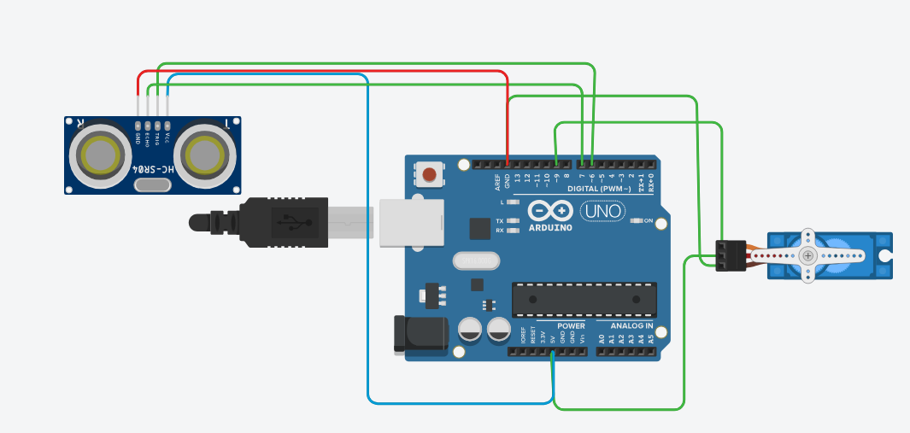

# 📡 Arduino Ultrasonic Sensor & Servo Motor

A simple **Arduino Uno automation project** using an **HC-SR04 Ultrasonic Sensor** and a **Servo Motor**.

The ultrasonic sensor measures the distance of an object. When an object comes within **30 cm**, the servo motor automatically rotates from **0° to 120°**, waits, and then returns from **120° to 0°**.

---

## 📌 Project Overview

This project demonstrates how an Arduino can use an ultrasonic sensor to detect nearby objects and control a servo motor automatically.

### Working Principle

```text
        Object
          ↓
    ┌───────────┐
    │ HC-SR04   │
    │ Ultrasonic│
    │  Sensor   │
    └─────┬─────┘
          │
          │ Distance
          ▼
    ┌───────────┐
    │ Arduino   │
    │    Uno    │
    └─────┬─────┘
          │
          │ Control Signal
          ▼
    ┌───────────┐
    │   Servo   │
    │   Motor   │
    └───────────┘
```

---

## 🖼️ Circuit Diagram



> **Note:** Save the provided circuit image in your GitHub repository as `circuit-diagram.png` so it appears correctly in the README.

---

## 🛠️ Components Required

* Arduino Uno
* HC-SR04 Ultrasonic Sensor
* Servo Motor
* Jumper Wires
* Breadboard
* USB Cable
* Computer
* Arduino IDE

---

## 🔌 Pin Configuration

### HC-SR04 Ultrasonic Sensor

| HC-SR04 Pin | Arduino Uno |
| ----------- | ----------: |
| VCC         |          5V |
| GND         |         GND |
| TRIG        |          D6 |
| ECHO        |          D7 |

### Servo Motor

| Servo Wire | Arduino Uno |
| ---------- | ----------: |
| Signal     |          D9 |
| VCC        |          5V |
| GND        |         GND |

### Complete Connection

```text
HC-SR04
----------------
VCC  → 5V
GND  → GND
TRIG → D6
ECHO → D7


Servo Motor
----------------
Signal → D9
VCC    → 5V
GND    → GND
```

---

## 📡 HC-SR04 Ultrasonic Sensor

The **HC-SR04** measures distance by sending an ultrasonic pulse and measuring the time taken for the echo to return.

The Arduino uses:

```cpp
readUltrasonicDistance(6, 7)
```

where:

```text
Trigger → D6
Echo    → D7
```

The measured distance is converted into centimeters.

---

## ⚙️ Project Logic

The program continuously measures the distance.

### If distance is greater than or equal to 30 cm:

```text
No action
```

### If distance is less than 30 cm:

```text
Object detected
       ↓
Print distance
       ↓
Servo rotates 0° → 120°
       ↓
Wait 500 ms
       ↓
Servo rotates 120° → 0°
       ↓
Wait 5 seconds
       ↓
Measure distance again
```

---

## 💻 Source Code

```cpp
#include <Servo.h>

Servo myservo;

int pos = 0;
int cm = 0;

long readUltrasonicDistance(int triggerPin, int echoPin)
{
  pinMode(triggerPin, OUTPUT);

  digitalWrite(triggerPin, LOW);
  delayMicroseconds(2);

  digitalWrite(triggerPin, HIGH);
  delayMicroseconds(10);

  digitalWrite(triggerPin, LOW);

  pinMode(echoPin, INPUT);

  return pulseIn(echoPin, HIGH);
}

void setup() {

  digitalWrite(12, LOW);

  myservo.attach(9);

  Serial.begin(9600);
}

void loop() {

  cm = 0.01723 * readUltrasonicDistance(6, 7);

  if (cm < 30) {

    Serial.print(cm);
    Serial.println("cm");

    for (pos = 0; pos <= 120; pos += 1) {
      myservo.write(pos);
      delay(15);
    }

    delay(500);

    for (pos = 120; pos >= 0; pos -= 1) {
      myservo.write(pos);
      delay(15);
    }

    delay(5000);
  }
}
```

---

## 🧠 How the Code Works

### 1. Include Servo Library

```cpp
#include <Servo.h>
```

The Servo library allows the Arduino to control the servo motor position.

---

### 2. Create Servo Object

```cpp
Servo myservo;
```

This creates a servo object named `myservo`.

---

### 3. Define Variables

```cpp
int pos = 0;
int cm = 0;
```

* `pos` stores the servo angle.
* `cm` stores the measured distance in centimeters.

---

### 4. Ultrasonic Distance Function

```cpp
long readUltrasonicDistance(int triggerPin, int echoPin)
```

This function sends an ultrasonic pulse and measures the returning echo.

The trigger signal is generated using:

```cpp
digitalWrite(triggerPin, HIGH);
delayMicroseconds(10);
digitalWrite(triggerPin, LOW);
```

The echo duration is measured using:

```cpp
pulseIn(echoPin, HIGH);
```

---

### 5. Calculate Distance

```cpp
cm = 0.01723 * readUltrasonicDistance(6, 7);
```

The echo time is converted into distance in centimeters.

---

### 6. Detect Nearby Object

The program checks:

```cpp
if(cm < 30)
```

This means the servo will operate when an object is detected within **30 cm**.

---

### 7. Rotate Servo Forward

```cpp
for (pos = 0; pos <= 120; pos += 1) {
  myservo.write(pos);
  delay(15);
}
```

The servo smoothly rotates:

```text
0° → 120°
```

---

### 8. Rotate Servo Back

```cpp
for (pos = 120; pos >= 0; pos -= 1) {
  myservo.write(pos);
  delay(15);
}
```

The servo then returns:

```text
120° → 0°
```

---

### 9. Wait Before Next Detection

```cpp
delay(5000);
```

The Arduino waits for **5 seconds** before continuing.

---

## 📊 Serial Monitor Output

Open the Arduino Serial Monitor at:

```text
9600 baud
```

When an object is detected within 30 cm, the measured distance will be printed.

Example:

```text
25cm
22cm
18cm
15cm
```

---

## 🎯 Detection Range

The current program uses:

```cpp
if(cm < 30)
```

Therefore:

| Distance | Servo Action  |
| -------- | ------------- |
| ≥ 30 cm  | No action     |
| < 30 cm  | Servo rotates |
| < 20 cm  | Servo rotates |
| < 10 cm  | Servo rotates |

The trigger distance can easily be changed.

For example, to detect objects within **50 cm**:

```cpp
if(cm < 50)
```

---

## 🚀 How to Run the Project

### Step 1 — Install Arduino IDE

Install Arduino IDE on your computer.

### Step 2 — Connect Components

Connect the HC-SR04:

```text
VCC  → 5V
GND  → GND
TRIG → D6
ECHO → D7
```

Connect the servo:

```text
Signal → D9
VCC    → 5V
GND    → GND
```

### Step 3 — Open the Code

Open:

```text
ultrasonic_servo.ino
```

### Step 4 — Select Board

Go to:

```text
Tools → Board → Arduino Uno
```

### Step 5 — Select COM Port

Go to:

```text
Tools → Port
```

and select the Arduino COM port.

### Step 6 — Upload

Click **Upload**.

### Step 7 — Test

Place an object in front of the HC-SR04 at less than **30 cm**.

The servo should rotate:

```text
0° → 120° → 0°
```

---

## 🧪 Tinkercad Simulation

This project can be simulated using **Tinkercad Circuits**.

### Simulation Components

Add:

* Arduino Uno
* HC-SR04 Ultrasonic Sensor
* Servo Motor
* Jumper Wires

Start the simulation and move an object close to the ultrasonic sensor.

When the detected distance becomes less than **30 cm**, the servo will rotate.

---

## 📁 Project Structure

```text
Arduino-Ultrasonic-Servo/
│
├── README.md
├── ultrasonic_servo.ino
└── circuit-diagram.png
```

### Important

Save the circuit image in the repository as:

```text
circuit-diagram.png
```

The README displays it using:

```markdown

```

---

## 🎯 Learning Objectives

This project helps you understand:

* Arduino Uno
* HC-SR04 Ultrasonic Sensor
* Servo Motor
* Distance measurement
* `pulseIn()`
* `digitalWrite()`
* `delayMicroseconds()`
* Servo angle control
* Serial Monitor
* Conditional statements
* `for` loops
* Embedded systems fundamentals

---

## 🔮 Future Improvements

This project can be upgraded into:

* 🚪 Automatic Door
* 🅿️ Smart Parking System
* 🗑️ Automatic Dustbin
* 🚧 Automatic Barrier Gate
* 🚗 Parking Gate Controller
* 🤖 Obstacle Detection System
* 🔔 Distance Alarm
* 💡 Automatic Light Control
* 🏠 Smart Home Automation

---

## 🧰 Technologies Used

| Technology    | Purpose                 |
| ------------- | ----------------------- |
| Arduino Uno   | Microcontroller         |
| C/C++         | Programming Language    |
| HC-SR04       | Distance Measurement    |
| Servo Motor   | Mechanical Movement     |
| Servo Library | Servo Control           |
| Arduino IDE   | Development Environment |
| Tinkercad     | Circuit Simulation      |

---

## ⚠️ Important Notes

* Make sure the HC-SR04 `VCC` is connected to **5V**.
* Make sure the sensor `GND` and servo `GND` share a common ground with Arduino.
* The servo signal wire must be connected to **D9** according to this code.
* The ultrasonic sensor uses **D6** for TRIG and **D7** for ECHO.
* If the servo causes Arduino to reset or behave unexpectedly, use an appropriate external power supply for the servo and connect its ground to Arduino GND.

---

## 👨‍💻 Author

**Famid Khandoker**

BSc in Computer Science & Engineering

---

## ⭐ Support

If you find this project useful, please consider giving the repository a ⭐ on GitHub.

**Happy Coding! 🚀**
